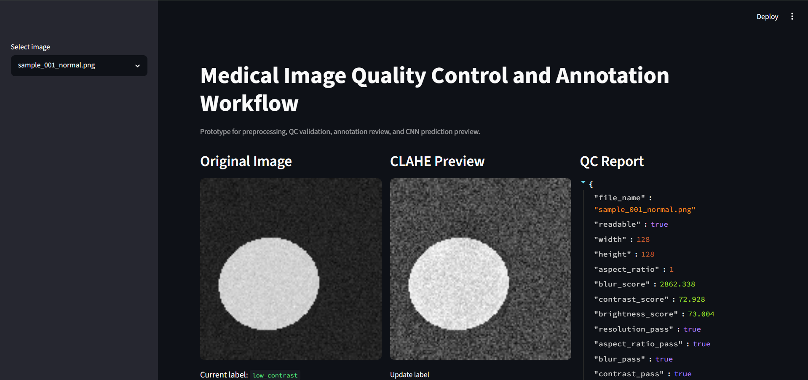
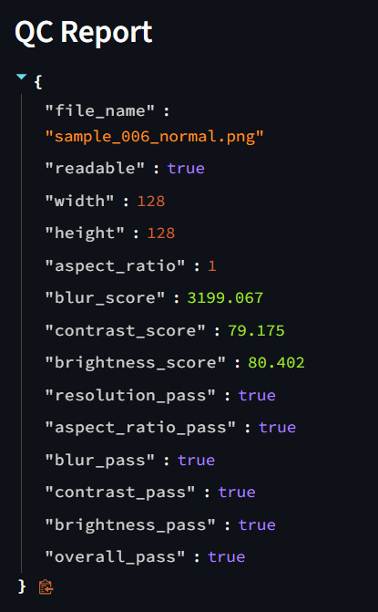

# Medical Image Quality Control and Annotation Workflow

A Python-based prototype for medical image preprocessing, automated image quality control, annotation review, and CNN-based classification. The project is designed for grayscale medical imaging workflows such as MRI, CT, X-ray, ultrasound, or microscopy-style images.

> Note: The included sample images are synthetic grayscale images for demo/testing only. Replace them with a real public dataset before presenting model accuracy as medical performance.

## Why this project exists

Medical imaging pipelines often need to validate image quality before training or inference. Poor contrast, blur, corrupted files, wrong resolution, and inconsistent labels can reduce model reliability. This project demonstrates a small but complete workflow for:

- image loading and preprocessing
- quality-control checks
- annotation review
- model training
- prediction preview
- automated tests

## Features

- Generates 120 synthetic grayscale sample images across 3 classes: `normal`, `low_contrast`, and `artifact`.
- Performs 6 automated QC checks: file readability, resolution, aspect ratio, blur, contrast, and brightness.
- Stores image metadata and labels in a CSV annotation file.
- Provides a Streamlit UI for reviewing images, QC results, and labels.
- Trains a compact PyTorch CNN classifier using an 80/20 train-validation split.
- Includes 12 Pytest tests for preprocessing and QC utility behavior.

## Project structure

```text
medical_image_qc_annotation_workflow/
├── app/
│   └── streamlit_app.py
├── artifacts/
│   └── .gitkeep
├── data/
│   └── sample_images/
│       └── .gitkeep
├── models/
│   └── .gitkeep
├── scripts/
│   └── generate_sample_data.py
├── src/
│   ├── __init__.py
│   ├── dataset.py
│   ├── model.py
│   ├── preprocess.py
│   ├── qc.py
│   └── train.py
├── tests/
│   ├── test_preprocess.py
│   └── test_qc.py
├── .gitignore
├── README.md
└── requirements.txt
```

## Setup

```bash
python -m venv .venv
source .venv/bin/activate  # Windows: .venv\\Scripts\\activate
pip install -r requirements.txt
```

## 1. Generate sample data

```bash
python scripts/generate_sample_data.py
```

This creates:

```text
data/sample_images/*.png
artifacts/annotations.csv
```

## 2. Run automated tests

```bash
pytest -q
```

## 3. Train the CNN model

```bash
python -m src.train --annotations artifacts/annotations.csv --image-dir data/sample_images --epochs 5
```

The trained model is saved to:

```text
models/simple_cnn.pt
```

## 4. Launch annotation and QC dashboard

```bash
streamlit run app/streamlit_app.py
```

The Streamlit app lets you:

- view grayscale images
- inspect QC status
- update labels
- export updated annotations
- preview model prediction when a trained model exists

## Demo Screenshots

### Annotation and QC Dashboard


### QC Report View


## Important honesty note for interviews

This is a prototype workflow, not a clinically validated medical device. In interviews, describe it as:

> I built a prototype workflow that demonstrates the type of preprocessing, QC validation, annotation review, and CNN model training used in medical imaging pipelines. The sample data is synthetic, but the code is structured so real MRI/CT/X-ray datasets can be added later.
